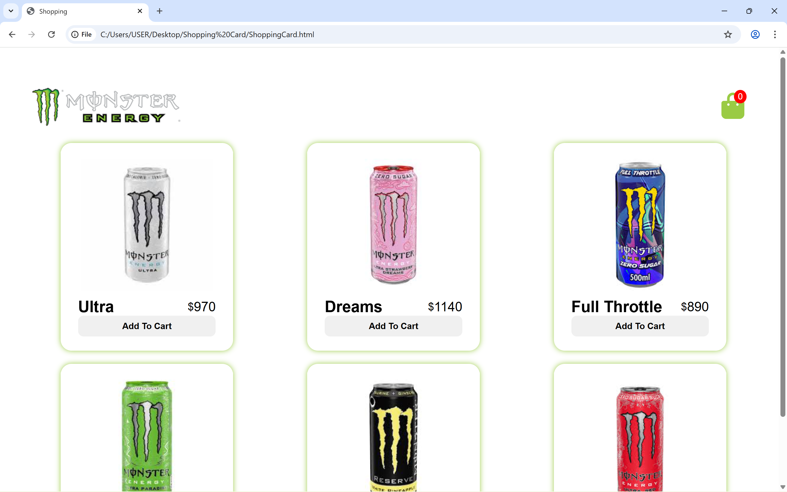
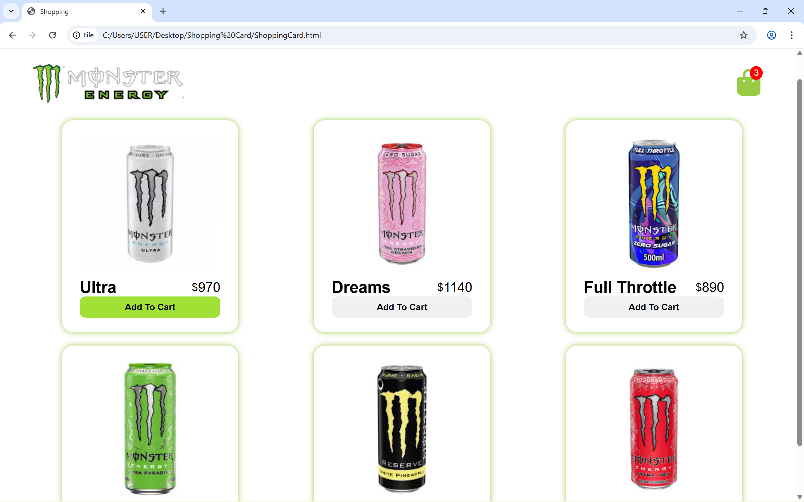
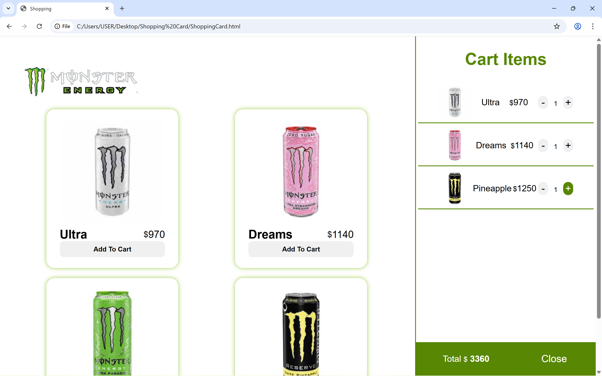

# Shopping Card

A simple shopping card project built with HTML, CSS, and Vanilla JavaScript. This project simulates a basic e-commerce card system where users can add, update, and remove products.

## Features

- Add products to card
- Increase / decrease product quantity
- Remove items from card
- Automatic total price calculation
- Responsive UI

## Technologies Used

- HTML5
- CSS3
- JavaScript (Vanilla JS)

## Preview

## Project Structure

Shopping-Card/
│
├── ShoppingCard.html
├── style.css
├── script.js
├── images/
└── README.md

##  Live Demo

https://mehrsabuildzone.github.io/shopping-card
